<h1 align="center">基于SpringBoot的商业辅助决策系统【带论文】</h1>

- <b>完整代码获取地址：从戎源码网 ([https://armycodes.com/](https://armycodes.com/))</b>
- <b>技术探讨、资料分享，请加QQ群：692619798</b>
- <b>作者微信：19941326836  QQ：3645296857</b>
- <b>承接计算机毕业设计、Java毕业设计、Python毕业设计、深度学习、机器学习</b>
- <b>选题+开题报告+任务书+程序定制+安装调试+论文+答辩ppt 一条龙服务</b>
- <b>所有选题地址 ([https://github.com/Descartes007/allProject](https://github.com/Descartes007/allProject)) </b>

## 一、项目介绍

基于SpringBoot的商业辅助决策系统，系统角色为 管理员 与 员工（yuangong），主要功能如下：
### 管理员：
- 基本操作：登录、注销、修改密码、获取/修改个人信息、session 查询
- 用户管理：用户列表分页、查看用户详情、新增/修改/删除用户、重置密码、注册
- 员工管理：员工列表分页、查看员工详情、新增/修改/删除员工、重置/忘记密码、员工登录令牌管理
- 字典管理：字典分页、查看、新增/修改/删除字典、最大编码查询、变更后同步到应用字典缓存
- 公告管理：公告列表、详情、新增/修改/删除
- 收支管理：收支记录的列表/详情/新增/修改/删除、二级类型管理
- 销售订单管理：销售订单列表/详情/新增/修改/删除、级联员工信息
- 薪资管理：薪资记录列表/详情/新增（自动计算实发工资）、修改/删除
- 文件管理：文件上传（保存到静态目录）
### 员工：
- 基本操作：登录、注销、修改密码、获取/修改个人信息、session 查询
- 自身数据操作：
- 查看自己相关的公告/收支/销售/薪资记录（系统会在查询/保存时根据角色限制为当前员工）、
- 新增自己的收支/销售/薪资记录（受唯一性校验）

## 二、项目技术

- 编程语言：Java（后端）、JavaScript（前端）
- 项目架构：B/S 架构，后端 RESTful 风格接口返回统一 R 对象，前端基于 Vue 单页应用
- 后端技术：Spring Boot 2.x、MyBatis / MyBatis-Plus、Maven、Servlet Session、Fastjson、Hutool、MySQL
- 前端技术：Vue 2.x、vue-router、Element UI、Axios（封装统一请求拦截）、vue-quill-editor（富文本）

## 三、运行环境

- JDK版本：1.8及以上都可以
- 操作系统：Windows7/10、MacOS
- 开发工具：IDEA、Ecplise、MyEclipse都可以

## 四、数据库配置文件

- npm版本：6.14.13及以上都可以
- Redis版本：3.2.100及以上都可以
- 文件名：application.yml
- 编码类型：utf8

## 论文截图

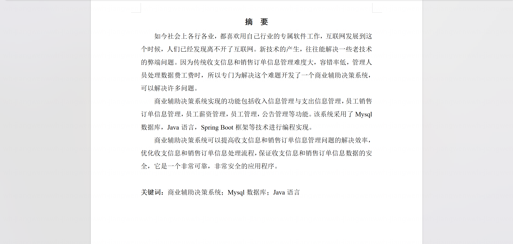

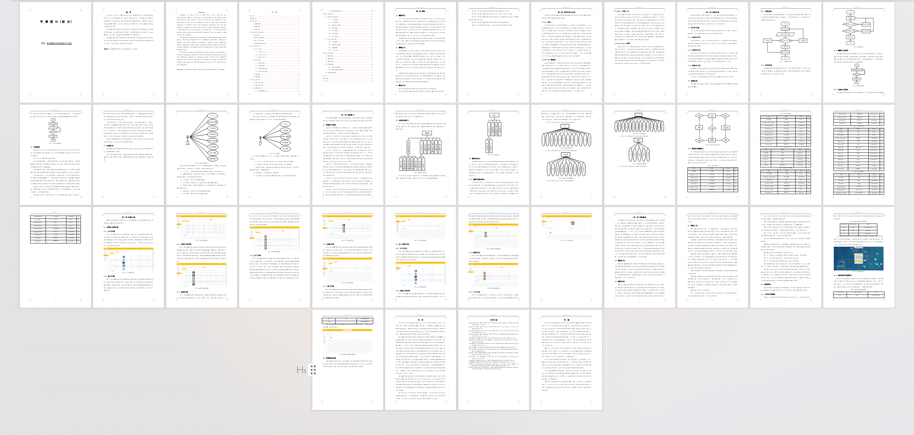

## 系统截图

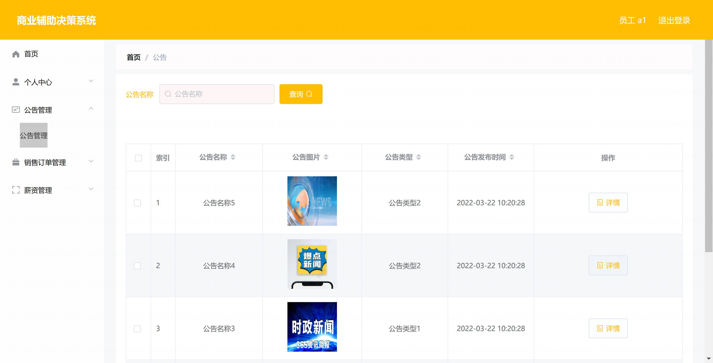

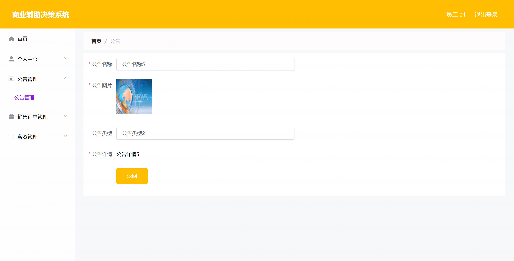

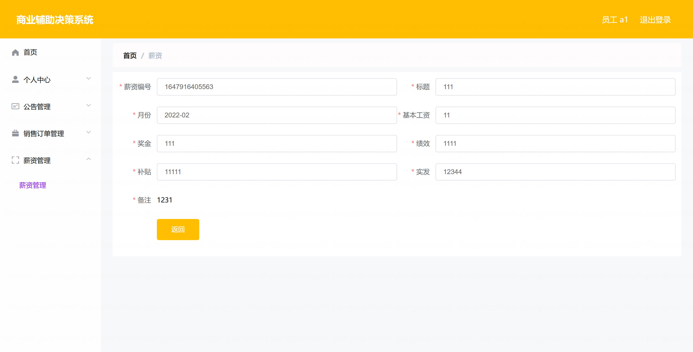

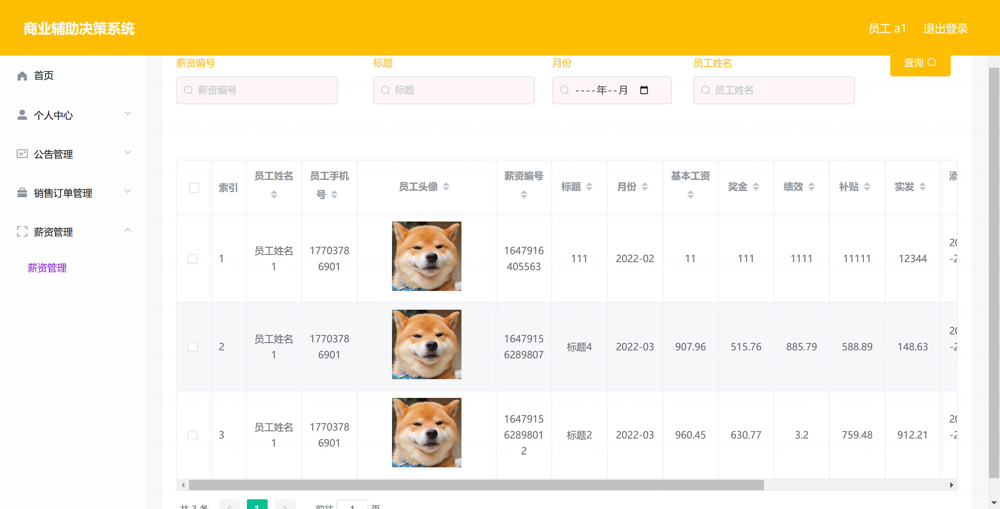

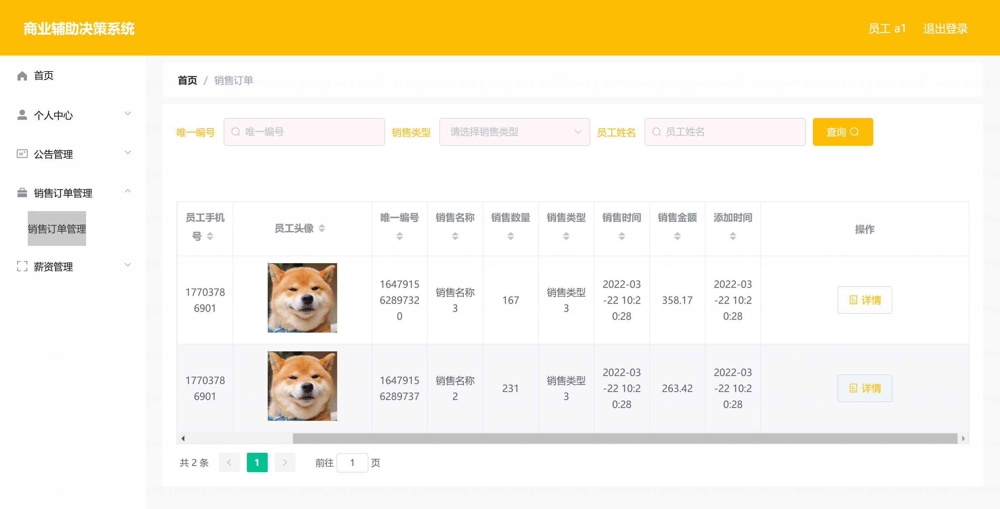

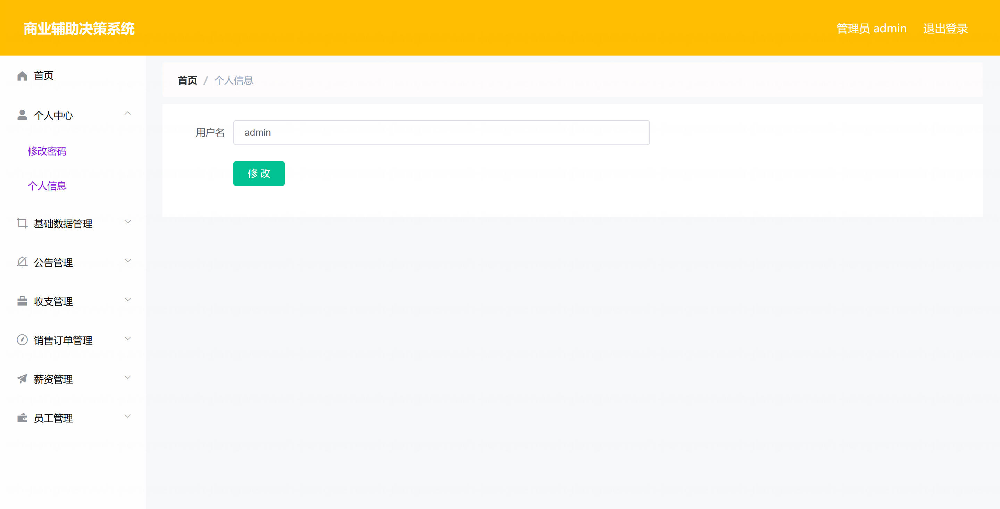

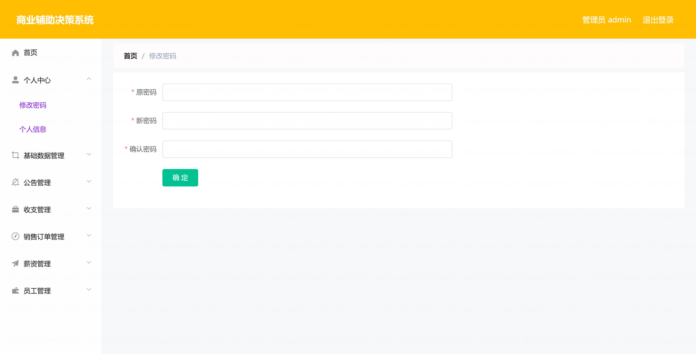

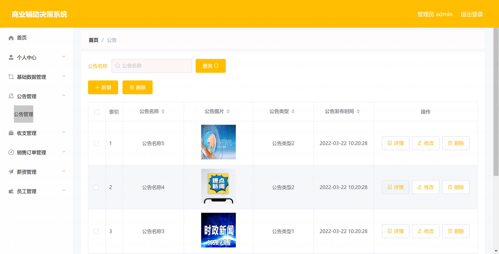

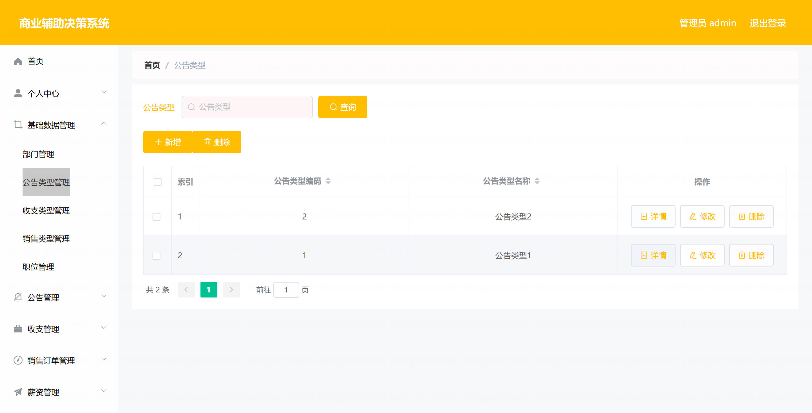
